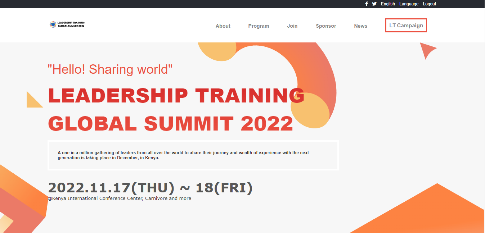
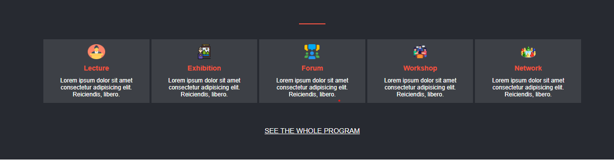
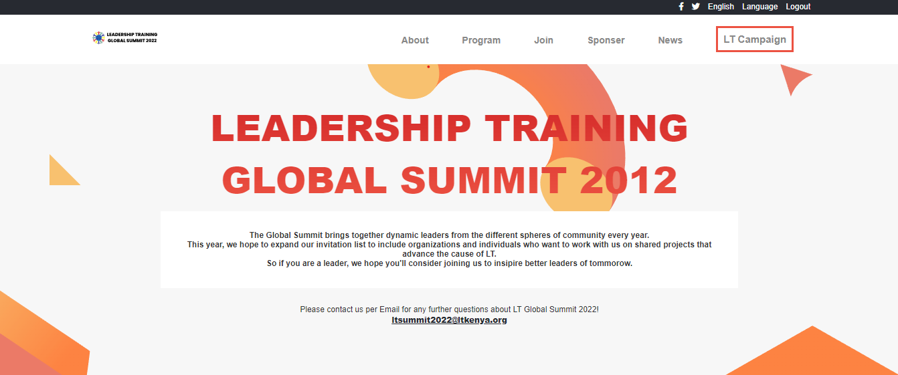
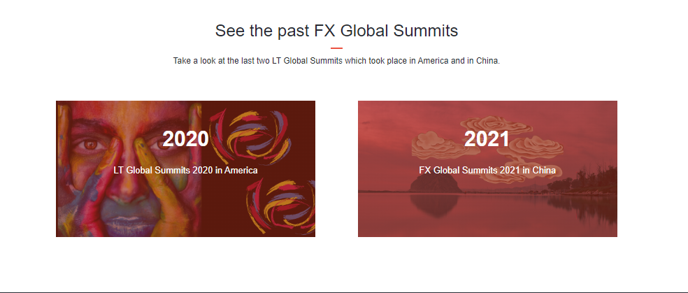
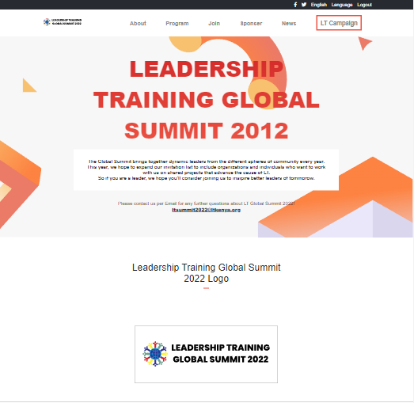

# Project Name

> In this first capstone project, I have built an online website for a leadership conference..

## Built With

- HTML 
- CSS
- JavaScript

## Live Demo (if available)

[Live Demo Link](http://rn486.github.io/Capstone1-project/)

## Project Screenshots

## Authors

👤 **Author1**

- GitHub: [@githubhandle](https://github.com/Rn486)
- Twitter: [@twitterhandle](https://twitter.com/recillahk)
- LinkedIn: [LinkedIn](https://www.linkedin.com/in/recillah-khamala-071151b7/)

## 🤝 Contributing

Contributions, issues, and feature requests are welcome!

Feel free to check the [issues page](https://github.com/Rn486/HTML-CSS-JavaScript-capstone-project/issues/).

## Show your support

Give a ⭐️ if you like this project!

## Acknowledgments

- Original design idea by Cindy Shin in Behance.

## 📝 License

This project is [MIT](./MIT.md) licensed.
